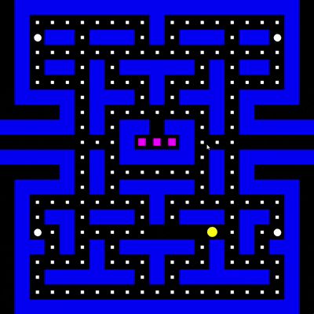

# pacman-clone

Classic Pac-Man arcade game implemented in C++ with SFML. Features grid-rail movement, ghost frightened states triggered by power-ups, edge teleportation, and a two-player local mode.

<p align="center">
  
</p>

## Features

- **Grid-rail movement** — tile-locked movement with direction queuing for both players
- **Ghost frightened state** — ghosts slow down and become vulnerable when Pac-Man collects a power-up
- **Edge teleportation** — Pac-Man and ghosts wrap around map edges
- **Two-player local** — Pac-Man (arrow keys) vs. Ghost (WASD)

## Requirements

- CMake 3.14+
- C++23 compiler (MSVC, GCC, Clang)

## Build & Run

Using the provided script:

```bash
./build.sh
```

Or manually with CMake:

```bash
cmake -B build
cmake --build build
./build/Debug/Pacman.exe
```

## Controls

| Action     | Pac-Man | Ghost |
|------------|---------|-------|
| Move up    | ↑       | W     |
| Move down  | ↓       | S     |
| Move left  | ←       | A     |
| Move right | →       | D     |
| Quit       | ESC     | ESC   |
